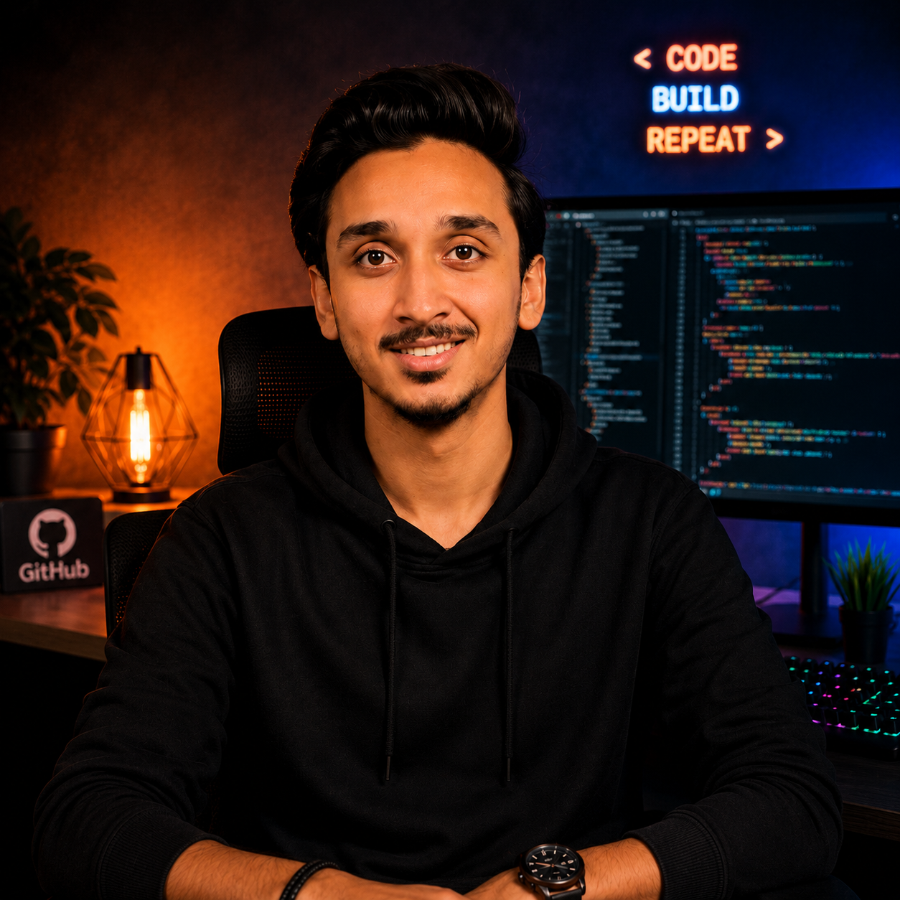

  

<h1 align="center">Muhammad Wajahat Ullah Ansari</h1>

<h3 align="center">
💻 Full Stack Web Developer
</h3>

Passionate about building modern, responsive and scalable web applications using
<b>React.js</b>, <b>PHP</b> and <b>MySQL</b>.

---

# 👨‍💻 About Me

- 💻 Full Stack Web Developer
- ⚛️ Frontend Development with **React.js**
- 🛠️ Backend Development using **PHP**
- 🗄️ Database Management with **MySQL**
- 🎨 Strong skills in **HTML5**, **CSS3**, and **JavaScript**
- 🚀 Passionate about creating responsive and user-friendly web applications
- 🌱 Currently learning advanced Full Stack Development
- 🤝 Open to Internship, Freelance & Collaboration opportunities

 

---

# 🚀 Tech Stack

---

# 📊 GitHub Statistics

---

